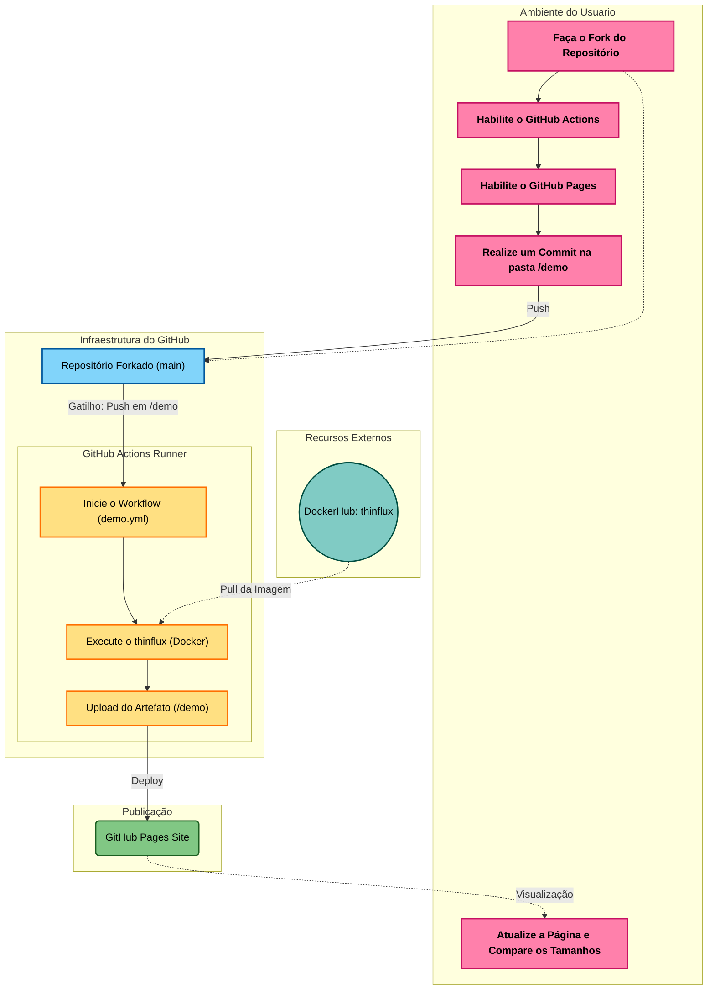

# 🌊 ThinFlux: Assets Multi-threaded Optimizer


### Colabore com a validação do projeto

Teste o ThinFlux e preencha o breve questionário: https://forms.gle/gvYzm4PXtZZijX8r8

> [!IMPORTANT]
> **Antigo Optirust:** Este projeto foi renomeado de **Optirust** para **ThinFlux**. 
> Se você está migrando de uma versão anterior, atualize suas referências de imagem Docker para `betoxvt/thinflux` e renomeie seu arquivo de configuração para `thinflux.toml`.

Um motor CLI de alta performance desenvolvido em Rust para otimização, compressão e purgo estrutural agressivo de ativos multimídia (Imagens e PDFs). Ideal para ser integrado em esteiras de CI/CD para reduzir o peso de artefatos antes do deploy.

> [!WARNING]
> Os arquivos otimizados sobreescrevem arquivos com mesmo nome no destino.

### 🕵️ Auditoria de Dependências Estática
Como parte do nosso processo de liberação de versão (Release), o arquivo `Cargo.lock` é auditado utilizando a ferramenta `cargo-audit` contra o banco de dados oficial da **RustSec Advisory Database**. Isso garante que o binário embutido na imagem Docker final está livre de vulnerabilidades conhecidas na cadeia de suprimentos.

## 🚀 Diferenciais Técnicos
- **Processamento Paralelo (Rayon):** Diferente de scripts sequenciais, o ThinFlux utiliza um pool de threads para processar múltiplas imagens simultaneamente, escalando a performance de acordo com os núcleos da CPU.

- **Arquitetura Robusta:** Separação clara entre o motor de compressão (`optimizer`), o rastreador de arquivos (`scanner`) e o gerador de métricas (`report`).

- **Segurança de Memória:** Aproveita o sistema de _ownership_ do Rust para garantir que a manipulação de arquivos e buffers de memória seja livre de _data races_.

- **Configuração Flexível:** Suporte a arquivos `thinflux.toml` para definição de níveis de compressão e persistência de preferências.

## 🛠️ Tecnologias Utilizadas

- **Rust** (Core Engine)
- **Rayon** (Data Parallelism)
- **Oxipng & Image** (Image Processing)
- **Lopdf** (PDF Structural Modification)
- **Docker & GitHub Actions** (CI/CD DevOps)
- **Clap** (CLI Argument Parsing)
- **Indicatif** (Dinamic Progress Bar)
- **Tempfile** (Temporary Files)
- **Serde** (JSON Serialization & TOML Configuration Persistence)
- **Chrono** (Timestamping)
- **Colored** (ANSI terminal colors)

## 🏗️ Arquitetura do Projeto

```
├── src/                        # Código Fonte
│   ├── main.rs                 # Entrada do programa
│   ├── config.rs               # Configuração e Persistência
│   ├── report.rs               # Gerador de Relatórios
│   ├── scanner.rs              # Rastreador de Arquivos
│   └── optimizer.rs            # Motor de Compressão
├── tests/                      # Testes de Integração
├── demo/                   
│   ├── assets/                 # Ativos para demonstração
│   ├── index.html              # Página da demonstração
│   └── iniciar_demo.txt        # Altere este arquivo para iniciar o Actions
├── .github/workflows/
│   ├── ci.yml                  # Pipeline CI/CD do ThinFlux
│   └── demo.yml                # Pipeline de demonstração usando o ThinFlux
├── docs/                       # Documentação do projeto
├── examples/                   # Scripts criados durante o desenvolvimento 
├── Cargo.toml                  # Configuração do Cargo
├── Cargo.lock                  # Lockfile do Cargo
├── Dockerfile                  # Arquivo Docker
├── thinflux_report.json        # Relatório real
├── thinflux.toml               # Configuração padrão
├── test_input.png              # Imagem para testes unitários
└── README.md                   # Documentação
```

## 📦 Como Instalar e Operar 
**Pré-requisitos**

- Rust (Cargo) 1.70+

- Ambiente Linux (Homologado em Arch Linux)

**Compilação de Alta Performance**

Para obter o máximo de desempenho do paralelismo, compile sempre em modo release:

```Bash
cargo build --release
```

### ⌨️ Guia de Uso da CLI

O ThinFlux opera através de subcomandos e flags direto no terminal. A estrutura básica do comando é:

```
thinflux [SUBCOMANDO] [CAMINHO] [FLAGS]
```

**Subcomandos**

- `run`: Inicia a otimização de imagens e PDFs no diretório especificado.
- `init`: Inicializa um arquivo de configuração padrão (thinflux.toml) no diretório atual para você customizar as regras sem precisar digitar flags longas toda vez.

**Flags e Opções do Subcomando `run`**

| **Flag Curta** | **Flag Longa** | **Valor Esperado** | **Descrição** |
| -------------- | -------------- | ------------------ | ------------- |
| nenhuma | nenhuma | `[path/to/dir]` | O caminho para a pasta que contém as mídias a serem tratadas. |
| `-l` | `--level` | `[0-6]` | Nível de Compressão: Sobrescreve o arquivo TOML. 0 é ultra rápido, 6 é compressão máxima de bytes. |
| `-t` | `--types` | `[png,jpg,jpeg,webp,pdf]` | Filtro de Extensões: Permite isolar os alvos. Se você passar `-t png,pdf`, ele ignorará todos os JPEGs e WebPs da pasta. |
| `-c` | `--config` | `[path/to/config.toml]` | Configuração Manual: Aponta para um arquivo TOML customizado em vez de usar o padrão do sistema. |
| `-s` | `--summary` | nenhum | Resumo Visual: Desenha uma tabela de fechamento com os ganhos de peso. |
| nenhuma | `--silent` | nenhum | Modo Silencioso: Apaga logs e barras de progresso. Perfeito para não poluir o histórico de logs do GitHub Actions. |

### 📊 Exemplo de Relatório (JSON)
Ao final de cada execução, o ThinFlux gera um `thinflux_report.json` detalhado para auditoria:

```JSON
{
  "timestamp": "2026-03-17T14:20:00Z",
  "status": "success",
  "summary": {
    "files_processed": 12,
    "total_original_size_kb": 4500.5,
    "total_optimized_size_kb": 3200.2,
    "space_saved_kb": 1300.3,
    "efficiency_gain_percent": 28.9
  },
  "files": [
    {
      "name": "hero-banner.png",
      "path": "./assets/hero-banner.png",
      "original_kb": 1200.0,
      "optimized_kb": 850.5,
      "saved_kb": 349.5,
      "ratio": "29.1%"
    }
  ]
}
```

## 🐳 Uso via Docker (DevOps Ready)
O ThinFlux está disponível como uma imagem Docker ultra-leve (baseada em scratch), ideal para ser integrada em pipelines de CI/CD para otimização automática de assets.

### 1. Rodando a imagem do Docker Hub

```Bash
# Otimizando uma pasta local usando o container
docker run --rm -t -v $(pwd)/assets:/data betoxvt/thinflux:latest run /data --summary
```
> [!TIP]
> Use a flag `-t` do `docker run` para ver o relatório colorido!

### 2. Construindo a imagem localmente
Utilizamos um processo de Multi-stage build para garantir que a imagem final contenha apenas o binário estático:

```Bash
docker build -t thinflux .
```

### 3. Integração em Pipeline (Exemplo GitHub Actions)
Você pode usar o ThinFlux para otimizar imagens antes do deploy:

```YAML
- name: Optimize Assets
  run: |
    docker run --rm -v ${{ github.workspace }}/assets:/assets \
    betoxvt/thinflux:latest run /assets
```
## 🧪 Quick Lab: Teste o ThinFlux em 1 minuto
Você pode testar o poder de compressão do ThinFlux diretamente no seu navegador, usando o GitHub Actions como laboratório. O resultado será uma página como esta: https://rgermangn.github.io/thinflux/
### 1. Preparação
1. Faça um ***Fork*** deste repositório.
2. No seu fork, vá na aba Actions e clique no botão verde para habilitar os workflows (*"I understand my workflows, go ahead and enable them"*).
3. No seu *fork*, vá em **Settings > Pages**. Em **Build and deployment > Source**, altere para **GitHub Actions**.
### 2. O Cenário Inicial
1. Aguarde o primeiro deploy (veja na aba Actions).
2. Acesse a URL gerada (ex: https://seu-usuario.github.io/thinflux/).
3. Você verá uma galeria com 22 imagens e 2 PDFs marcados como "Aguardando otimização...". Note que os tamanhos exibidos são os originais (baseados no sistema de arquivos).
### 3. Disparando a Otimização
Agora, vamos ver o ThinFlux em ação no pipeline:
1. No seu repositório, vá até a pasta `demo/` e crie ou edite um arquivo qualquer (ex: edite o arquivo `iniciar_demo.txt` adicionando uma palavra).
2. Clique em ***Commit changes...*** para salvar direto na branch `main`.
3. Isso disparará o workflow de forma isolada no seu Fork, rodando o motor ThinFlux diretamente nas imagens da pasta de demonstração!
### 4. O Resultado
1. Vá na aba Actions e acompanhe o workflow "ThinFlux Demo Lab". Você verá o Docker esmagando as imagens em tempo real.
2. Quando terminar, volte à sua página do GitHub Pages e dê F5.
3. Mágica: A tabela agora mostrará o tamanho "Original" (riscado) e o novo tamanho "Otimizado", calculando a porcentagem exata de economia de espaço.

Os resultados devem ser próximos aos expressos nesta tabela:

| **Categoria**   | **Métrica**                     | **Valor Obtido**       |
| --------------- | ------------------------------- | ---------------------- |
| **Compressão**  | Economia Total de Dados         | 2.901,21 KB (~2,83 MB) |
| **Compressão**  | Ganho Médio de Eficiência       | 12,0%                  |
| **Compressão**  | Melhor Caso Individual          | 66,0% (Arquivo 15.png) |
| **Compressão**  | Pior Caso Individual            | 1,7% (Arquivo 04.png)  |
| **Performance** | Tempo Total do Pipeline (CI/CD) | 26s                    |
| **Performance** | Tempo de Vida do Contêiner      | 9s                     |
| **Performance** | Tempo Líquido de Compressão     | 6s                     |

### 🛠️ Como funciona este teste?
Este repositório utiliza um pipeline de CI/CD que:
- **Não altera seu código:** Os ativos originais na pasta `demo/assets` continuam inalteradas no Git.
- **Otimização *On-the-fly*:** O GitHub Actions usa a imagem Docker `betoxvt/thinflux` para otimizar os assets apenas durante o build.
- **Deploy Transparente:** Apenas as versões leves são enviadas para o servidor de hospedagem.

**Diagrama do fluxo operacional:**


## ✅ Funcionalidades Implementadas (v0.2.0)

- [x] **Arquitetura Concorrente de Alta Performance:** Processamento multimídia paralelo utilizando **Rayon** para extrair o máximo de desempenho de CPUs multi-core.
- [x] **Otimização de Imagens Dinâmica:** Compressão nativa e re-codificação de arquivos nos formatos `PNG` (via Oxipng), `JPEG` e `WebP`.
- [x] **Purgo Estrutural de PDFs:** Motor baseado em `lopdf` modificado para realizar remoção agressiva de metadados inúteis (`b"Info"`), descarte de referências mortas (`prune_objects`) e recompressão de streams de imagens internas de forma isolada e segura.
- [x] **Garantia Anti-Corrupção (Escrita Atômica):** Sistema de escrita baseado em arquivos temporários exclusivos por Thread para evitar condições de corrida (Race Conditions) e colisão de arquivos.
- [x] **Esteira de CI/CD e Docker Hub Automática:** Pipeline integrado no GitHub Actions que valida o código (Audit, Clippy, Tests), compila o binário e publica a imagem no Docker Hub de forma síncrona.

## 🗺️ Roadmap de Desenvolvimento

Abaixo estão as funcionalidades planejadas para as próximas iterações do ThinFlux:

- [ ] **Internacionalização (i18n):** Suporte a logs e relatórios em Inglês e Português.
- [ ] **Post-Compile Optimization (PCO):** Utilizar flags do Cargo.toml, seção `[profile.release]` para otimizar o binário final.
